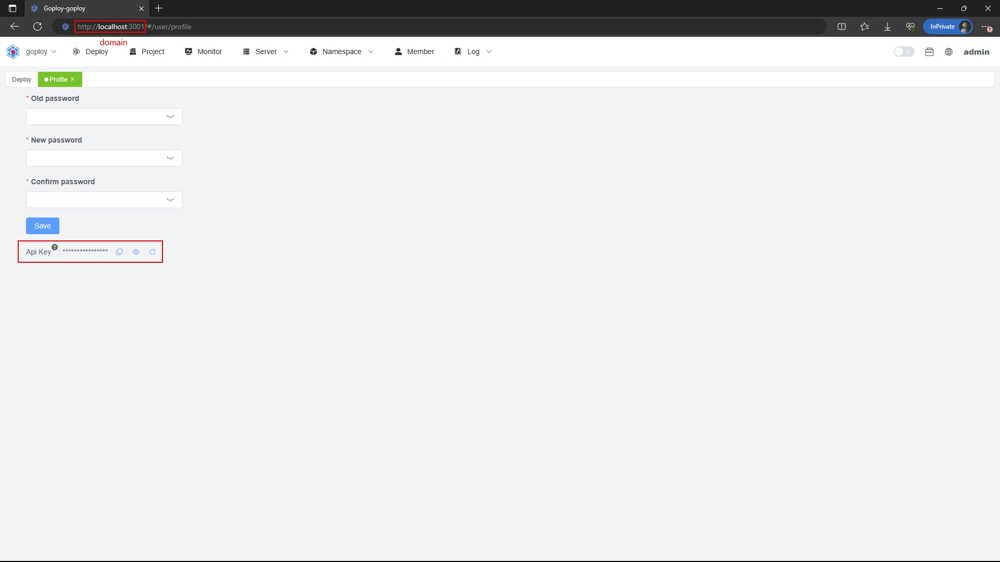

# Goploy Extension for Visual Studio Code

Name: go + deploy

A web deployment system tool!

Support all kinds of code release and rollback, which can be done through the web with one click!

Complete installation instructions, no difficulty in getting started!

## Features

Use Goploy to automate your development workflow, so you can focus on work that matters most. 

Goploy is commonly used for:

- Building projects

## Extension Settings

This extension contributes the following settings:

* `goploy.apiKey`: goploy api key
* `goploy.domain`: goploy domain like https://example.com

### For more information

* [Goploy](https://github.com/zhenorzz/goploy)
* [Website](https://www.goploy.icu)
* [Document](https://docs.goploy.icu)
